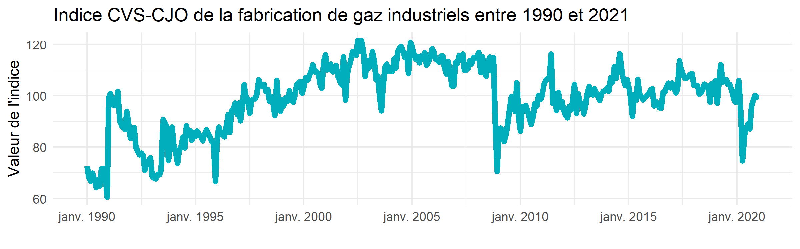

# Images

Retour au [README](./README.md#autres-graphiques).

## output/images/before_after.png

## output/images/arima212.png

## output/images/acf_pacf.png

## output/images/diff_ts.png

## output/images/df.png

## output/images/X.png

## output/images/ts_plot_github.png

## output/images/arima2113.png

## output/images/arima0113.png

## output/images/arima111.png

